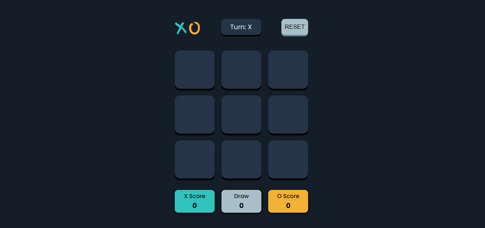

# Tic-Tac-Toe

This game's modern UI has a clean and attractive design that enhances the game experience. A visually appealing Tic-Tac-Toe game built with HTML, CSS, and JavaScript.

## Features

- The game boasts a sleek and modern design, making it visually engaging.
- A responsive design that works on all devices, from mobile to desktop.
- The board is interactive, allowing players to click on boxes to make their move.
- If a player wins, they are notified of their victory in the message box.
- If it's a draw (no one wins), there is a message for this too.
- In the message box, it also shows the player's turn.
- A convenient Reset button that allows to start a new game anytime.
- Display the Scores of both Players as well as Draw.

## Tech Stack

- HTML: Defines the structure and content of the page.
- CSS: Styles the visual appearance of the elements.
- JavaScript: Adds interactivity and dynamic behaviour.

## Watch the Live [Demo](https://nikhils045.github.io/Tic-Tac-Toe/)

- Website Link : https://nikhils045.github.io/Tic-Tac-Toe/

## SCREENSHOT

## Contributing

Feel free to fork the repository and submit pull requests with your enhancements or
bug fixes. We appreciate contributions that make the game even more enjoyable!

## Enjoy the Game!

Have fun playing this beautiful Tic Tac Toe game! Let us know if you have any
questions or feedback.
